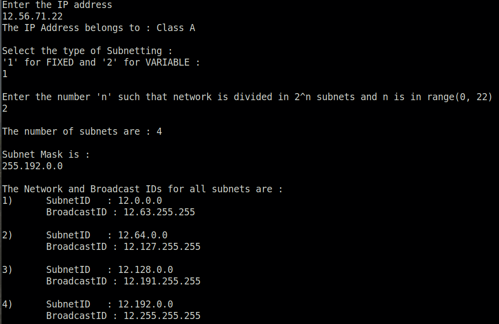
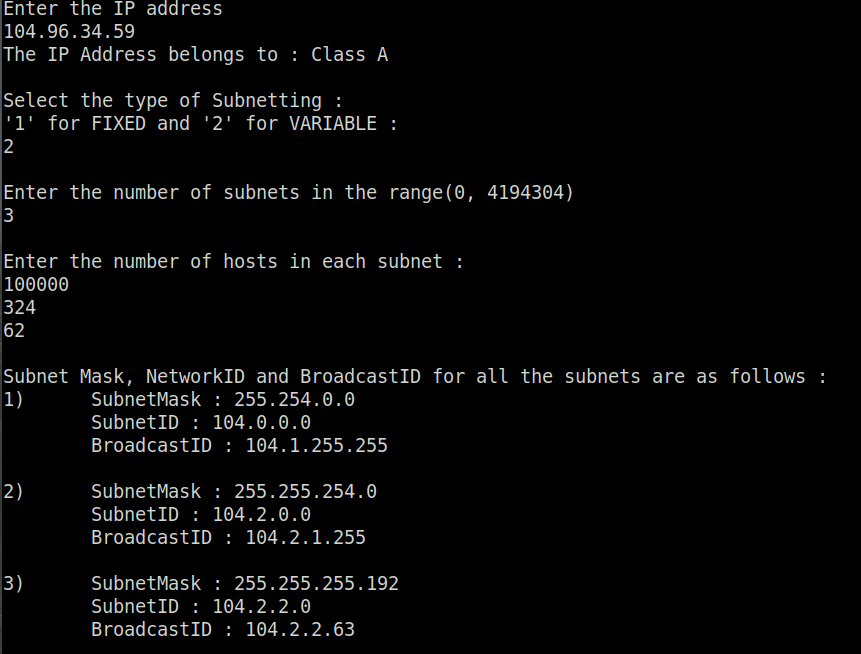
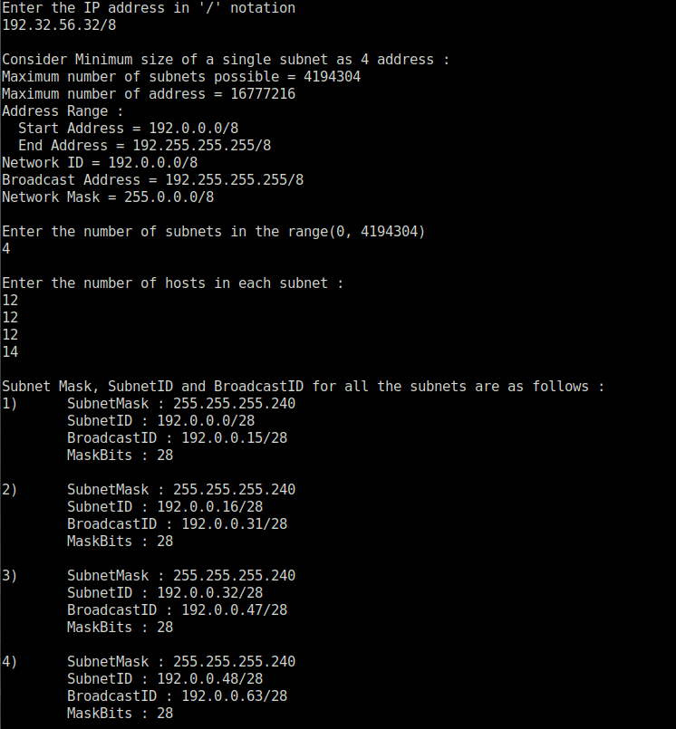

# Computer Networks Assignments

## Subnets

A **subnet** is a logical division of an IP network and the process of dividing a large network into more smaller networks is called **subnetting**.
Subnetting can be done using two methods :

1. *Fixed length subnet masking (FLSM)* : In Fixed length subnet masking, all subnets are of equal size and have equal number of hosts. There is wastage of IP addresses in this case.

2. *Variable length subnet masking (VLSM)* : The size of the subnets is variable and and each can have variable number of hosts thus making the IP addressing more efficient by allowing a routed system of different mask length to suit the requirements. There is minimum wastage of IP addresses.

More information on subnets can be found [here](https://en.wikipedia.org/wiki/Subnetwork)

The program *subnet.py* is the implementation of both the types of subnetting.

For fixed length subnet masking, the program takes input an IP address and the number *n* whose limit depends on the class of the IP address. The program divides the network into 2n subnets i.e the number of subnets must be a power of 2. The minimum size of subnet is considered to be 4 (Subnet-ID, Broadcast-ID, and 2 usable addresses). As the size of each subnet is same, every subnet has the same subnet mask. The program outputs the subnet mask and the (Subnet-ID, Broadcast-ID) for each subnet. Refer the image given below:

For variable length subnet masking, the program takes input an IP address and the number of subnets user wants. Here, the number of subnets need not be a power of 2. Further, the program also ask user to input the number of hosts required in each subnet. The output of the program is (Subnet-mask, Subnet-ID, Broadcast-ID) for each subnet.

Usage :
>   python3 subnet.py

## Classless Inter-Domain Routing (CIDR)

**Classless Inter-Domain Routing (CIDR)** is a method for allocating IP addresses and for IP routing. It is based on variable-length subnet masking (VLSM) which allows the specification of arbitrary-length prefixes. CIDR introduced a new method of representation for IP addresses, commonly known as **CIDR notation**, in which an address or routing prefix is written with a suffix indicating the number of bits of the prefix, such as *192.4.5.12/24*. For more information, click [here](https://en.wikipedia.org/wiki/Classless_Inter-Domain_Routing)

The program *cidr.py* contains the implementation of CIDR. Initially, the program inputs an IP address in CIDR notation and prints all the information related to the inputted IP address like maximum number of subnets, maximum number of addresses possible, address range, network id, broadcast address and network mask. Then user is expected to enter the number of subnets and the number of hosts in each subnet. The program divides the network in subnets with minimum wastage of IP and outputs all the required information. Refer the below image :

Usage :
>   python3 cidr.py

## Simple Client-Server Model

The directory *simple_client_server* contains implementation of simple client server model using socket programming in python. The client sends a connection request to the server and the server responds with the text *Hello World!!!* back if the connection is accepted.

Usage - Enter the following commands in two different terminals :
> python3 server.py

> python3 client.py

## UDP Communication

The directory *udp* contains implementation of client-server communication using User Datagram Protocol (UDP) which is a Transport Layer Protocol. The client requests a file to the server and the server responds back with that file if it is available. The client simply dumps the file in its current directory.

Usage - Enter the following commands in two different terminals :
> python3 udp_server.py

> python3 udp_client.py <file_name>

## TCP Communication

The directory *tcp* contains implementation of client-server communication using Transmission Control Protocol (TCP) which is a Transport Layer Protocol. The client requests a file to the server and the server responds back with that file if it is available. The client simply dumps the file in its current directory.

Usage - Enter the following commands in two different terminals :
> python3 tcp_server.py

> python3 tcp_client.py <file_name>
